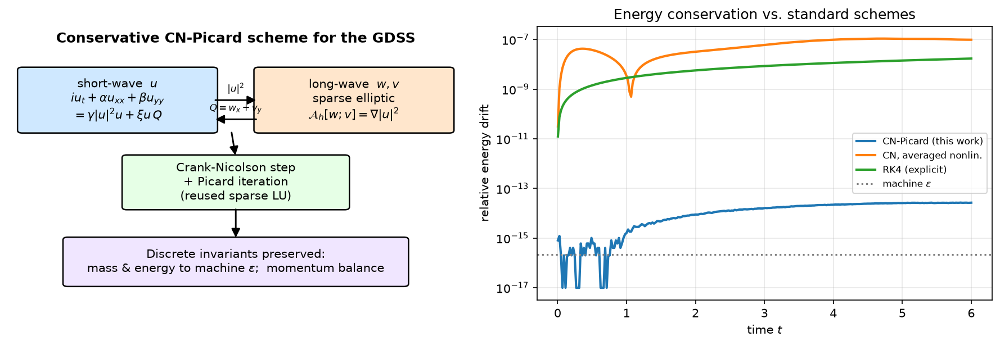

# Conservative Crank–Nicolson–Picard scheme for the Generalized Davey–Stewartson system

Reference implementation and reproducibility package for the paper

> **A Conservative Crank–Nicolson–Picard Finite-Difference Scheme for the Generalized Davey–Stewartson System: Discrete Invariants and Benchmark Validation**
> C. A. Molina-Holguín, J. E. Macías-Díaz, L. A. Gallegos-Infante.

The code integrates the two-dimensional generalized Davey–Stewartson system (GDSS)

```
 i u_t + α u_xx + β u_yy = γ|u|²u + ξ u (w_x + v_y)
 ψ w_xx + η w_yy + θ v_xy = ∂_x |u|²
 φ v_xx + χ v_yy + θ w_xy = ∂_y |u|²
```

on a bounded domain with homogeneous Dirichlet conditions, using a time-centered,
**discrete-gradient Crank–Nicolson step solved by Picard iteration**, while the two
coupled long-wave potentials `(w, v)` are recovered at each iteration from the
discrete elliptic subsystem via a single reusable sparse LU factorization.



## Key properties (proved and verified)

| Property | Result |
| --- | --- |
| Discrete mass and Hamiltonian energy | conserved exactly by the scheme; observed drift `~1e-14` (round-off and Picard tolerance) |
| Discrete momenta | explicit balance `δ_tJ = R_disp + R_cub + R_lw` (defect `~1e-14`); drift independent of `Δt` |
| Discrete long-wave operator | coercive uniformly in `h` (proved) |
| Spatial / temporal order | 2 (exact solutions; manufactured solution with time-dependent long-wave fields) |
| Long-wave recovery `w, v, Q` | order 2 |
| Stability | unconditional (proved); Picard stable to `16× CFL` |
| vs. non-conservative CN / RK4 | mass/energy drift 5–7 orders of magnitude smaller |

## Repository structure

```
.
├── run_all.py                 # regenerate every figure and table of the paper
├── requirements.txt
├── code/
│   ├── gdss_fdm_solver.py         # core: operators, elliptic recovery, CN–Picard step, diagnostics
│   ├── gdss_manufactured.py       # sympy-derived manufactured-solution source terms
│   ├── gdss_fdm_experiments.py    # convergence, conservation, momentum balance, localized run
│   ├── gdss_fdm_experiments2.py   # non-conservative comparison, long-time, w/v/Q recovery
│   ├── gdss_fdm_experiments3.py   # Picard/Δt robustness, boundary sensitivity, parameter regimes
│   ├── gdss_fdm_experiments4.py   # nonlinear dynamics (collision, self-focusing), cost scaling
│   ├── gdss_fdm_coupling_validation.py # mixed-coupling activation and sensitivity test
│   ├── gdss_fdm_momentum_refinement.py # momentum drift under space, time and domain-size refinement
│   ├── gdss_fdm_cost_comparison.py # reused LU versus repeated conjugate gradients
│   ├── gdss_fdm_reduction.py      # cross-check: reduction to the classical Davey–Stewartson system
│   ├── verify_reference_outputs.py # compare regenerated CSVs with archived deterministic values
│   └── make_graphical_abstract.py
├── reference_results/         # archived CSV tables used by the regression check
└── paper/                     # outputs of run_all.py (the manuscript source is not included)
    ├── Images/                    # figures of the article
    └── results_fdm/               # CSV results and LaTeX tables (tables/) of the article
```

## Installation

```powershell
python -m venv .venv
.\.venv\Scripts\Activate.ps1
python -m pip install -r requirements.txt
```

The reference environment is Windows 11 x86-64 with Python 3.12.10,
NumPy 2.5.2, SciPy 1.18.1, Matplotlib 3.11.1, and SymPy 1.14.0. Exact
versions are pinned in `requirements.txt`.

## Reproducing the results

```powershell
python run_all.py            # full run
python run_all.py --fast     # omit N=512 and the two dynamics runs
```

All figures are written to `paper/Images/` and all LaTeX tables to
`paper/results_fdm/tables/`, where the manuscript source expects them. The
driver then compares regenerated CSV values with `reference_results/` using
`rtol=1e-3` and `atol=1e-10`; quantities at the round-off scale use the absolute
tolerance only, and wall-clock timings are intentionally excluded.

You can also run any single experiment, e.g.:

```powershell
Set-Location paper
python ..\code\gdss_fdm_experiments2.py compare_cons
python ..\code\gdss_fdm_reduction.py
```

## Minimal usage example

```python
import sys; sys.path.insert(0, "code")
import numpy as np
from gdss_fdm_solver import GDSSParams, FDGrid, GDSSSolver

par = GDSSParams(alpha=1, beta=1, gamma=1, xi=1, psi=1, eta=2, phi=2, chi=1, theta=1)
g   = FDGrid(-10, 10, -10, 10, 128, 128)
sol = GDSSSolver(g, par)

r  = np.sqrt(g.X**2 + g.Y**2)
U  = g.flat((0.2/np.cosh(r) * np.exp(1j*(g.X+g.Y)/np.sqrt(2))).astype(complex))
M0, E0 = sol.mass(U), sol.energy(U)

for _ in range(226):
    U, iters = sol.step(U, dt=4.4248e-3, tol=1e-12)

print("mass drift :", abs(sol.mass(U)-M0)/M0)      # ~1e-14
print("energy drift:", abs(sol.energy(U)-E0)/E0)   # ~1e-14
```

## Citation

If you use this code, please cite the software and the associated article
(manuscript submitted for publication); see [`CITATION.cff`](CITATION.cff).
The software is archived on Zenodo:

- version 1.0.0 (IJMPC submission): [10.5281/zenodo.23030677](https://doi.org/10.5281/zenodo.23030677)

Development repository: <https://github.com/Camolina-uach/FDM-CN-Picard-GDSS>.

The article DOI will be added after publication. Changes between versions are
listed in [`CHANGELOG.md`](CHANGELOG.md).

## License

MIT — see [LICENSE](LICENSE).
